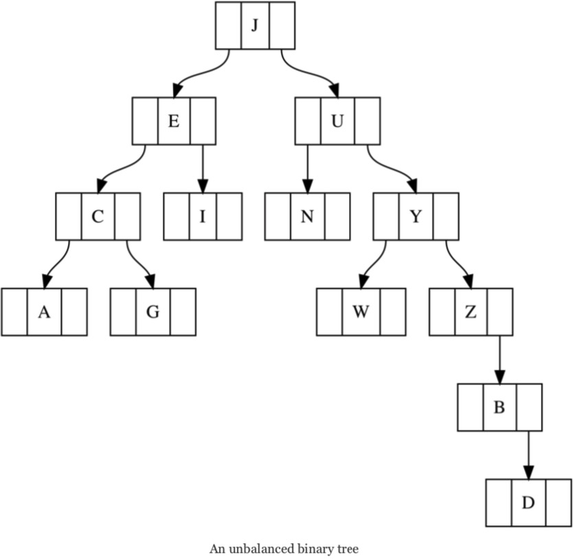

### Go 语言中的二叉树

**二叉树**是每个节点最多有两个两个分支的数据结构。“最多”表示一个节点可以连接一至两个子节点，或者不连接其他子节点。**树的根节点**是树结构中的第一个节点。**树的深度**，又称为树的高度，是从树的根节点到所有节点的路径中最长的一个。而节点的深度是该节点到树的根所经过的路径中边的数量。**叶节点**是没有子节点的节点。

若一个树的根节点到任意两个叶节点的距离之差不大于 1，则认为这个树是**平衡的**。顾名思义，非平衡树不是平衡的。树的平衡操作困难又缓慢，所以最好从一开始就让你的树保持平衡，而不是在建好树之后再去调整，尤其是这个树有很多节点的时候。

下图是一个非平衡二叉树。它的节根点是 J，叶节点包括 A、G、W 和 D。

