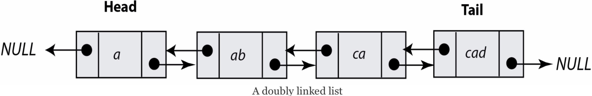
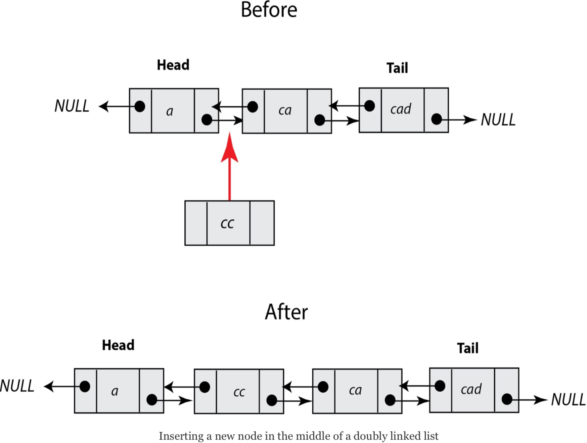

### Go 语言中的双向链表

**双向链表**中的每个节点都既有指向前一个元素的指针，又有指向下一个元素的指针。

双向链表形如下图：

因此，在一个双向链表中，第一个节点的后链接指向第二个节点，而它的前链接指向 `nil`（也称为 **NULL**）。类似的，最后一个节点的后链接指向 `nil`，而它的前链接指向双向链表中的倒数第二个节点。

本章的最后一个插图阐明了双向链表中增加节点的操作。可想而知，这个过程中的主要任务是处理新节点、新节点左侧节点、新节点右侧节点这三个节点的指针。

所以，单向链表和双向链表的主要区别实际上只是双向链表的操作更冗杂。这是你为了能够从两个方向都能访问双向链表所必须付出的代价。